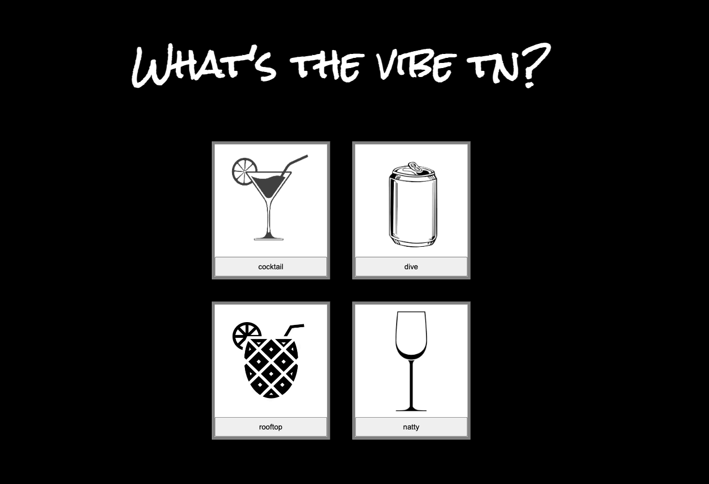
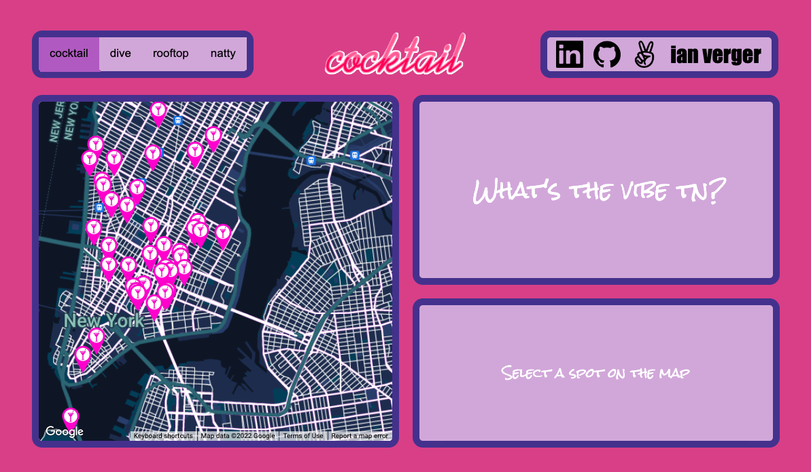
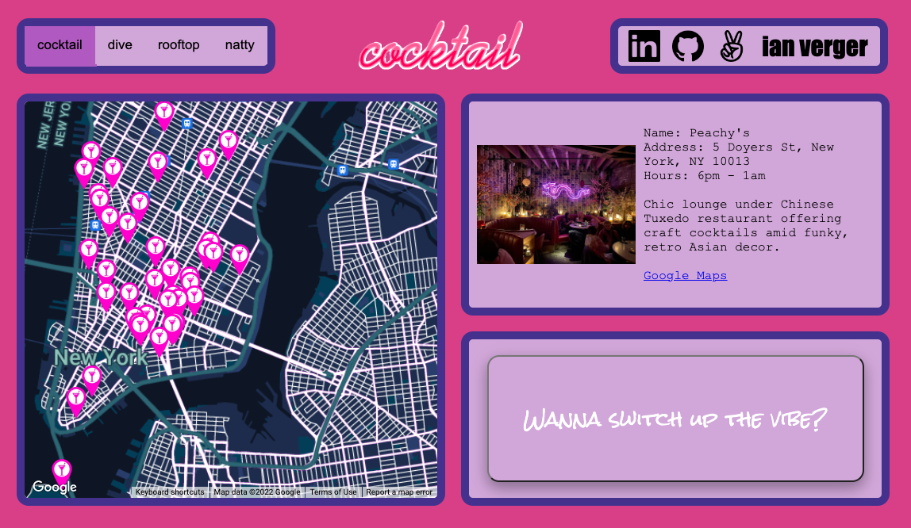
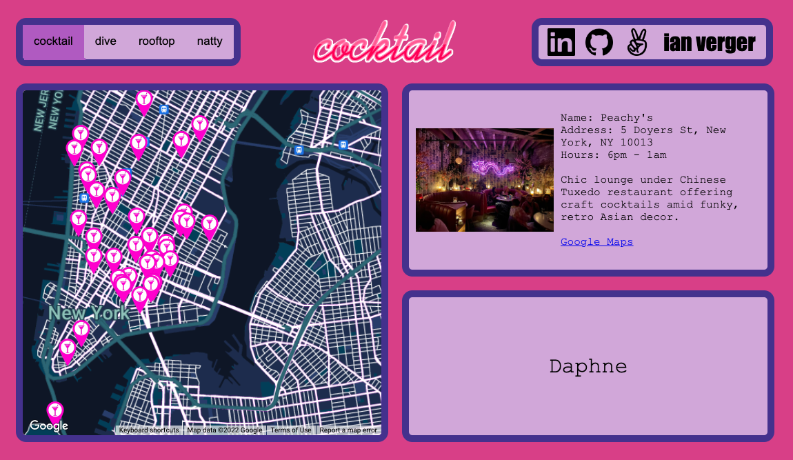
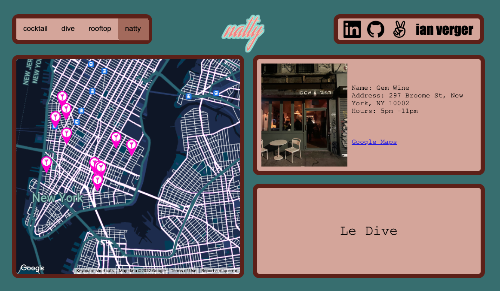
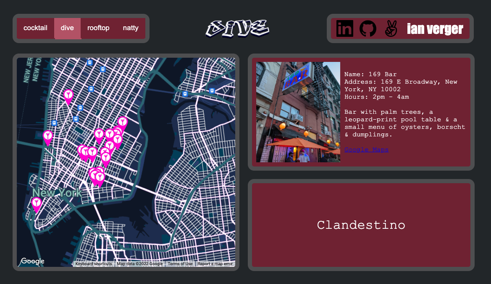
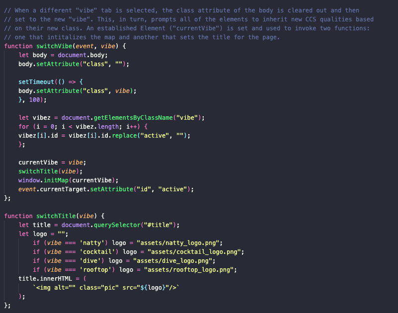
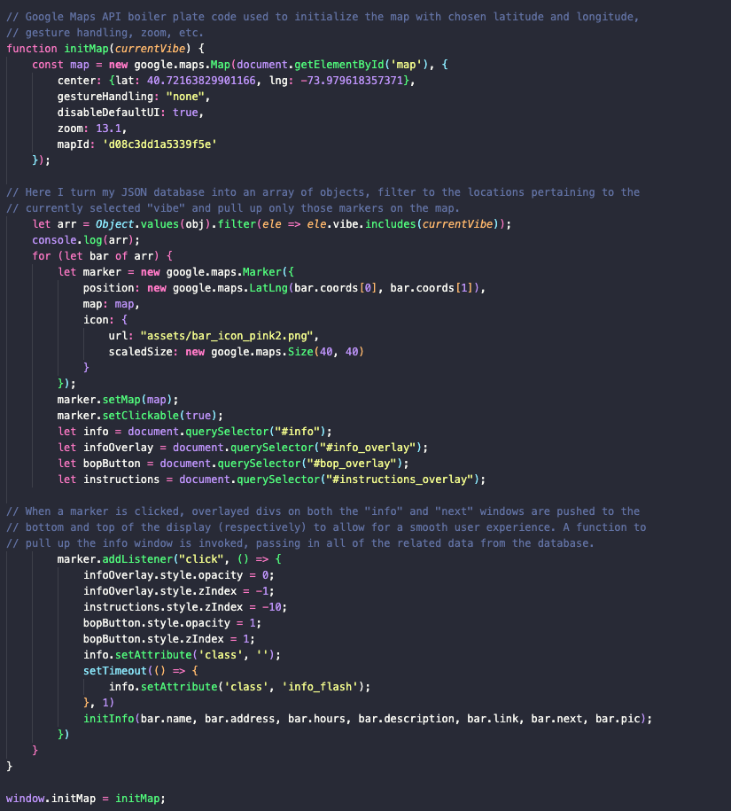
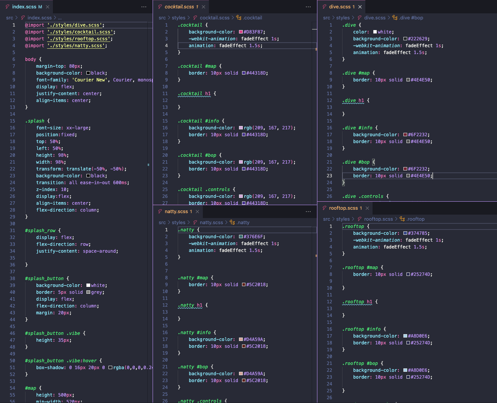
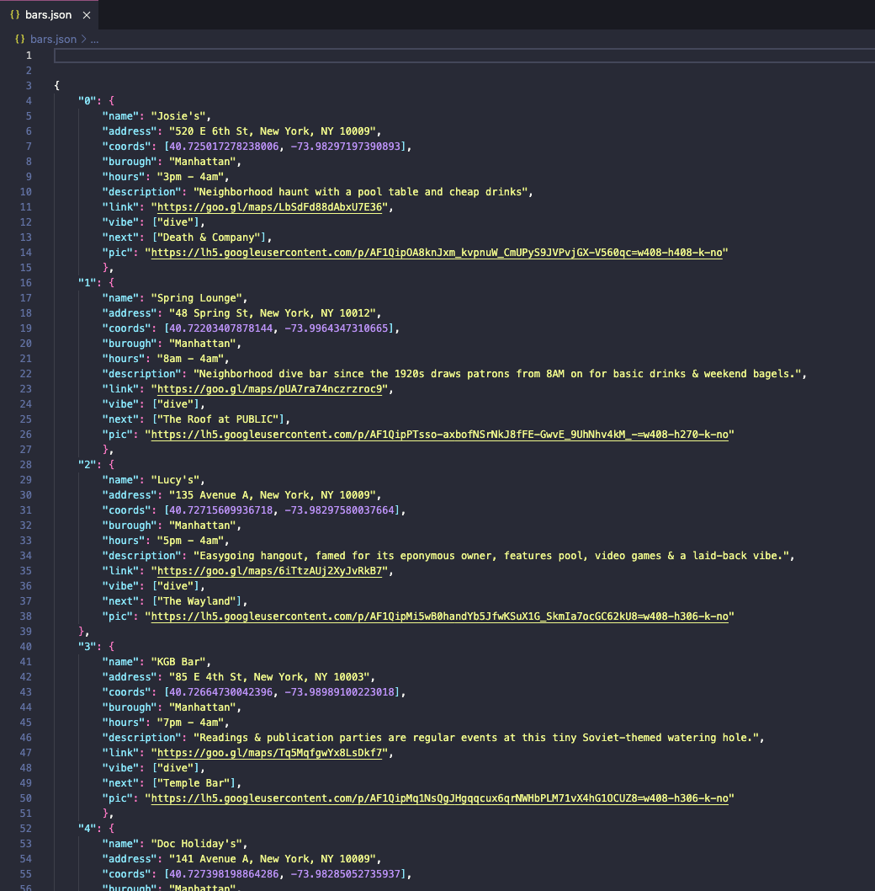

# What's the vibe tn?

[What's the vibe tn? (live link)](https://ianverger.github.io/Whats-the-vibe-tn/)

⨯ . ⁺ ✦ ⊹ ꙳ ⁺ ‧ ⁺ ✦ ⊹ . * ꙳ ✦ ⊹ ⨯ . ⁺ ✦ ⊹ ꙳ ⁺ ‧ ⨯. ⁺ ✦ ⊹ 

"What's the vibe tn?" is a data visualization in which users are able to explore an interactive map of the Lower Manhattan/North Brooklyn area to peruse a highly curated collection of top-notch bars, lounges, and clubs, based on a selected category. 

Depending on the category selected (Dive, Cocktail, Rooftop, etc.), the map filters the corresponding establishments and provides information to the user including hours of operation, customer rating, a brief description, and other bars in the general area that they could potentially move to in order to elevate their evening.

The view and entire "vibe" of the page shifts depending on the vibe the user currently has selected. Options to "switch up the vibe" list alternative bar options in the area that offer a different atmosphere.

⨯ . ⁺ ✦ ⊹ ꙳ ⁺ ‧ ⁺ ✦ ⊹ . * ꙳ ✦ ⊹ ⨯ . ⁺ ✦ ⊹ ꙳ ⁺ ‧ ⨯. ⁺ ✦ ⊹ 

## Instructions for Use

1. Upon entering, the user is directed to a splash page where they are prompted to pick their initial "vibe"

2. Users are redirected to the "vibe" page they selected where they can explore different estblishments on the map in that respective category

3. Once an establishment is selected, corresponding information is displayed in the upper right window

4. If users are inclined to head to another nearby destination, they can click on the lower right window to "switch up the vibe" (v2 to include additional info)

5. If users want to explore establishments in a different category they can do so by accessing tabs on the upper left window

⨯ . ⁺ ✦ ⊹ ꙳ ⁺ ‧ ⁺ ✦ ⊹ . * ꙳ ✦ ⊹ ⨯ . ⁺ ✦ ⊹ ꙳ ⁺ ‧ ⨯. ⁺ ✦ ⊹ 

## Functionality & MVPs

With "What's the vibe tn?", users will be able to

    ♦  Access (v1) 'dive', 'cocktail', 'rooftop', and 'natty' vibes
    ♠  Browse corresponding establishments and related data
    ♥  Jump to 'next spots' and 'switch up the vibe'
    ♣  Scan the map based on vibe

⨯ . ⁺ ✦ ⊹ ꙳ ⁺ ‧ ⁺ ✦ ⊹ . * ꙳ ✦ ⊹ ⨯ . ⁺ ✦ ⊹ ꙳ ⁺ ‧ ⨯. ⁺ ✦ ⊹ 

## Technologies, Libraries, APIs

    ♦  Google Maps API
    ♠  DOM to manage the html
    ♥  Webpack and babel to bundle the javascript code
    ♣  Github to host the site and manage version control

⨯ . ⁺ ✦ ⊹ ꙳ ⁺ ‧ ⁺ ✦ ⊹ . * ꙳ ✦ ⊹ ⨯ . ⁺ ✦ ⊹ ꙳ ⁺ ‧ ⨯. ⁺ ✦ ⊹ 

## Technical Implementation Details

### Javascript implementation (annotated in notes)

### Dynamic CSS styles change accoring to currently selected "vibe"

### I seeded this JSON database of curated New York establishments by hand. v2 to include establishments in Brooklyn and Queens.

⨯ . ⁺ ✦ ⊹ ꙳ ⁺ ‧ ⁺ ✦ ⊹ . * ꙳ ✦ ⊹ ⨯ . ⁺ ✦ ⊹ ꙳ ⁺ ‧ ⨯. ⁺ ✦ ⊹ 
